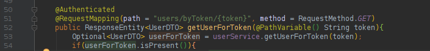

# Custom authentication module for Spring framework

The purpose of this module is to handle authentication comfortably, just by annotating an endpoint or service.



*As you can see, only one annotation is needed on the custom API or service method, and the module uses its own annotation!*

### Stored data

The module uses 2 tables, `au_user` and `au_user_token`. The user table stores data for users, like name, username, email address, etc. 
The token table stores the currently logged in users auth token, and validity time.

### Usage

The module publishes an API (`{your_base_url}/users`) where users can register, and log in. During login, the user receives
 an authentication token, hereinafter he should use this token as authentication in every request. Using the `@Authenticated`
 annotation the programmer secures an API or service method. Calling an annotated
method, the authentication aspect hijacks the call and validates the token. The validation procedure is simple, the user sends his token in the 
`X-Auth-Token` HTTP header, and if the token is valid, and the
user has the needed role (`ADMIN` or `USER`, for now), then the request is valid, else an exception is thrown which handled by
an ExceptionHandler, and pushed back to the caller, who should handle it.

The token expires in 30 minutes, but every annotated method call changes the expiration time to call time + 30 minutes.

### Endpoints

#### `POST users`:

The user calls this, to register into the system. Posted data is a complete UserDTO:
```
    realName: String
    username: String
    emailAddress: String
    role: String
    password: String
```

The role is filled with `USER` during registration. If you want `ADMIN` users, create them in the database manually.

Response is the registered user, without password.

#### `POST users/login`:

The user calls this, to login to the system. Posted data is a UserDTO containing username and password:
```
    username: String
    password: String
```

Response is a newly created auth token:
```
    token: String
```

#### `GET users/byToken/{token}`:

The user can call this, to get the stored User data, for a valid token. This request uses the authentication procedure,
so a valid token must be presented in the HTTP header too.

Response is a full user, without password

### Password storage

The module uses the Spring salted hash technique to store and validate passwords. No dictionary attacks is possible.

### Interceptors

If you want to execute custom code during registration, login or authentication, the module provides interceptor interfaces.
With them you can execute any code during these processes, just implement the needed interface, any number of times, the
engine will get them from the context, and call the methods:

* AuthenticationInterceptor
* LoginInterceptor
* RegisterInterceptor

### Messages

During registration, login and authentication, errors can happen. These errors will be given back to the caller of the API with
HTTP Response code 400 in this message format:
```
    severity: Severity
    message: String
```
Where severity can be:
```
    INFO
    WARNING
    ERROR
    DEBUG
```
But mostly, ERROR.

And message can be:
```
    INVALID_TOKEN - during authentication
    USED_USERNAME - during registration
    USED_EMAIL_ADDRESS - during registration
    INVALID_CREDENTIALS - during login
    INSUFFICIENT_PERMISSION - during authentication
```
One can easily use an interceptor for example registration data validation, 
and send an adequate error code with this message format, calling the UserException constructor with string.

**Copyright 2019 Robin Kurovszky**

Licensed under the Apache License, Version 2.0 (the "License");
you may not use this file except in compliance with the License.
You may obtain a copy of the License at

http://www.apache.org/licenses/LICENSE-2.0

Unless required by applicable law or agreed to in writing, software
distributed under the License is distributed on an "AS IS" BASIS,
WITHOUT WARRANTIES OR CONDITIONS OF ANY KIND, either express or implied.
See the License for the specific language governing permissions and
limitations under the License.
